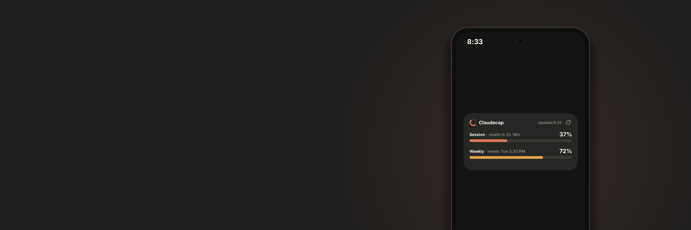
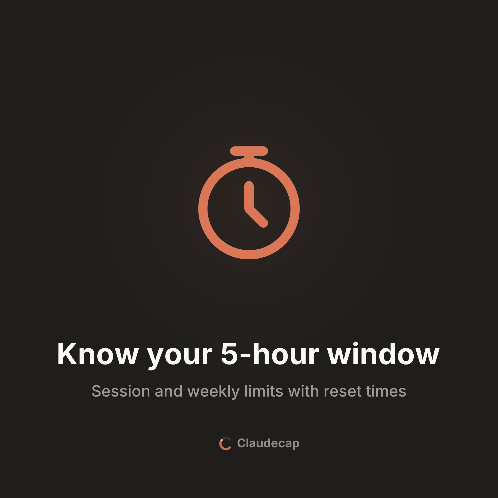
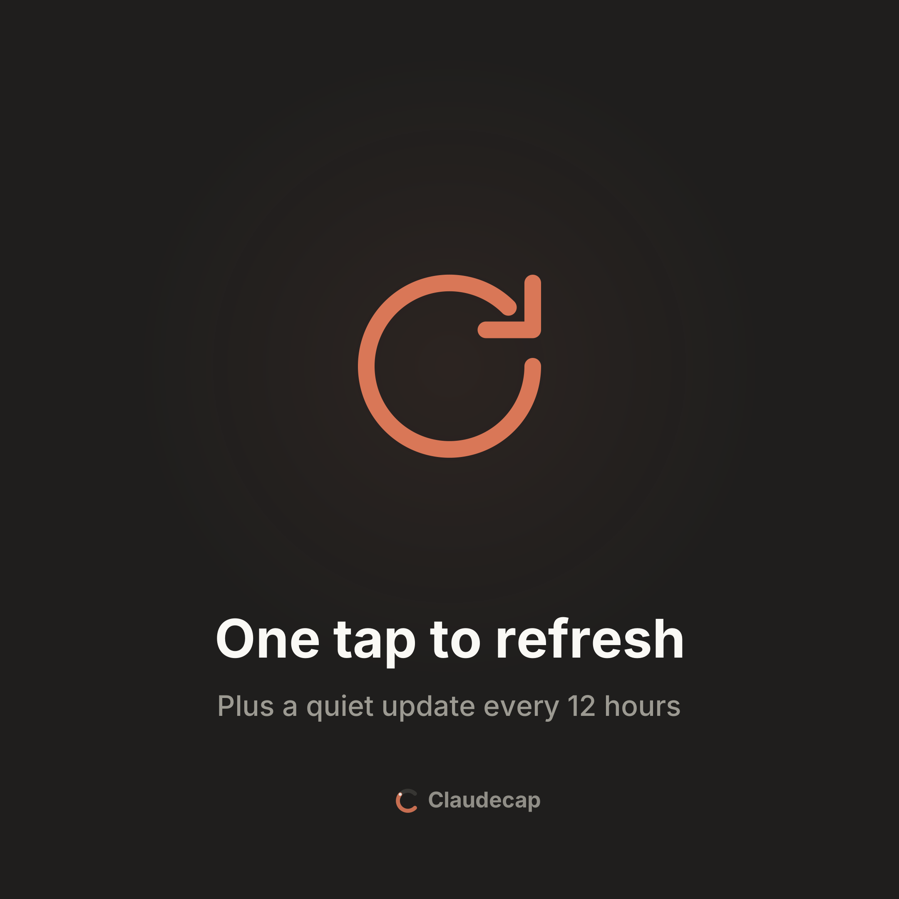
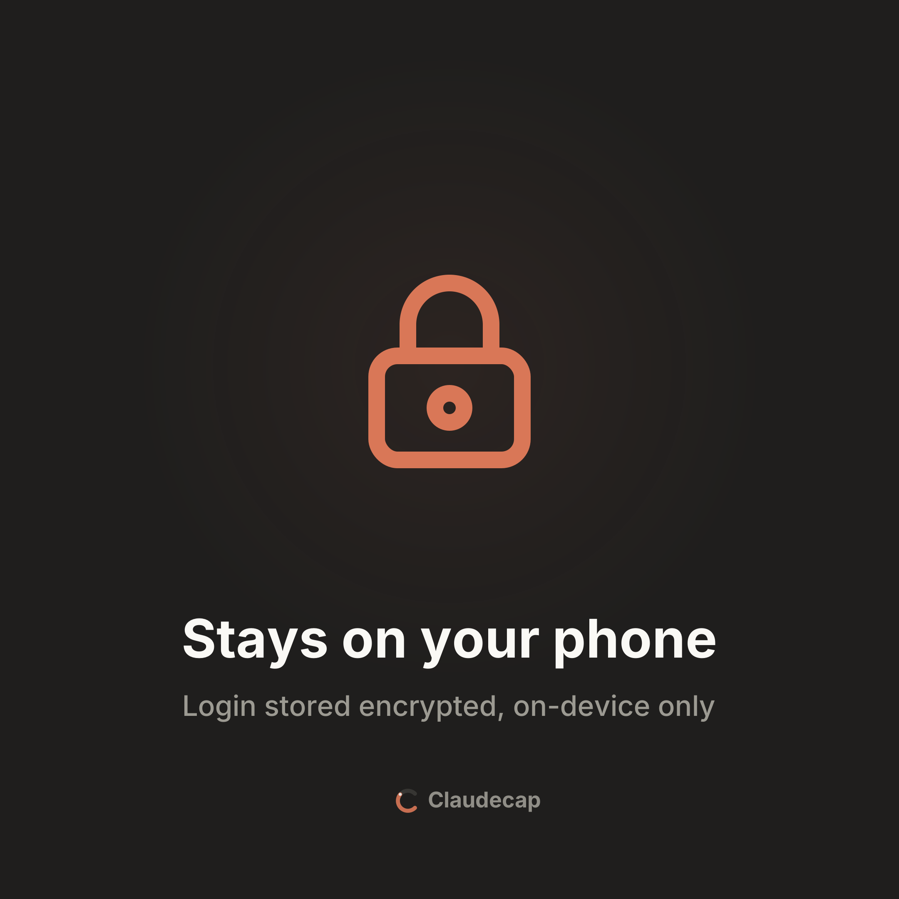

<p align="center">
  
</p>

<h1 align="center">ClaudeCap</h1>

<p align="center">
  An Android home-screen widget that shows your Claude usage at a glance:<br>
  the 5-hour session limit, the weekly limit, and when each one resets.
</p>

---

## Features

<table>
  <tr>
    <td width="33%"></td>
    <td width="33%"></td>
    <td width="33%"></td>
  </tr>
</table>

- **Session and weekly bars** with live reset countdowns. Bars turn amber at 70% and red at 90%.
- **One tap to refresh.** Tap the reload icon on the widget; a spinner shows while it fetches.
- **Auto-refresh in the background** every 3, 6, 12 or 24 hours (default 12, set in the app). It runs through WorkManager, so the app doesn't need to be open.
- **Stays on your phone.** Your login is stored encrypted with the Android Keystore and is only ever sent to claude.ai.
- **Tiny.** The release APK is about 1.9 MB.

## Requirements

- Android 12 or newer (API 31+)
- A Claude account with usage limits (Pro, Max)

## Install

1. Get the APK and install it. You may need to allow installs from your browser or file manager.
2. Open **ClaudeCap** and tap **Sign in**.
3. Use **Continue with email**, then enter the verification code sent to your inbox.
   - Google sign-in does **not** work inside the app (Google blocks sign-in from embedded browsers).
   - If a cookie banner appears, accept it. Sign-in needs cookies.
4. Long-press your home screen → **Widgets** → **ClaudeCap**, and place it.

The app screen shows the same usage card, your signed-in email, and the auto-refresh interval picker.

### When your session expires

The claude.ai login lasts weeks but eventually expires. The widget will then show **Tap to sign in**. Open the app and sign in again; you don't need to re-add the widget.

## How it works

Anthropic doesn't offer a public API for plan usage. ClaudeCap calls the same endpoint the claude.ai **Settings → Usage** page uses:

```
GET https://claude.ai/api/organizations/{org_id}/usage
```

with your claude.ai session cookie. It reads the `limits` array (`session` and `weekly_all` entries) for the percentage and reset time of each window.

If Cloudflare blocks the direct request, it falls back to running the same fetch inside a hidden WebView on the claude.ai origin. A refresh can take 15–20 seconds when that happens.

> [!WARNING]
> This is an **unofficial, undocumented endpoint**. Anthropic can change or block it at any time, and the widget will stop working until it's updated. This project isn't affiliated with or endorsed by Anthropic.

## Privacy

- Your session cookie is encrypted with an Android Keystore AES-256-GCM key and stored only on the device.
- It's sent only to `claude.ai`, never anywhere else. Nothing is logged.
- App backups are disabled, and all traffic is HTTPS.
- Each person signs in with their own account. Don't share your session cookie.

## Build from source

Requires JDK 17 and the Android SDK (platform 36).

```sh
./gradlew assembleDebug        # debug APK
./gradlew testDebugUnitTest    # unit tests
./gradlew lintDebug            # lint
./gradlew assembleRelease      # release APK (R8 + resource shrinking)
```

Outputs:

| Build   | Path                                                      | Size    |
| ------- | --------------------------------------------------------- | ------- |
| Debug   | `app/build/outputs/apk/debug/app-debug.apk`               | ~16 MB  |
| Release | `app/build/outputs/apk/release/app-release-unsigned.apk`  | ~1.9 MB |

The debug APK is signed with the debug key and installs as-is. The release APK is **unsigned**, and Android won't install it until you sign it:

```sh
keytool -genkey -v -keystore ~/claudecap-release.jks \
    -keyalg RSA -keysize 2048 -validity 10000 -alias claudecap

$ANDROID_HOME/build-tools/36.0.0/apksigner sign \
    --ks ~/claudecap-release.jks \
    --out app-release.apk \
    app/build/outputs/apk/release/app-release-unsigned.apk
```

Keep the keystore out of git (`*.jks` and `*.keystore` are already ignored).

Install over USB:

```sh
adb install -r app-release.apk
```

## Tech stack

- Kotlin, native Android, single `app` module
- Jetpack **Glance** for the widget
- **WorkManager** for background refresh
- **OkHttp** for networking, `org.json` for parsing
- Plain Android Views for the app screens (no Material, no AppCompat)
- AGP 9.4, Gradle 9.8, minSdk 31, targetSdk 36

## Project layout

```
app/src/main/java/dev/asrithtanniru/claudecap/
  MainActivity.kt         app screen: usage card, account, refresh interval
  LoginActivity.kt        claude.ai sign-in in a WebView
  data/                   secure storage, fetchers, parser, repository
  widget/                 Glance widget, refresh action, worker, scheduler
art/                      logo, banner and promo images
```
